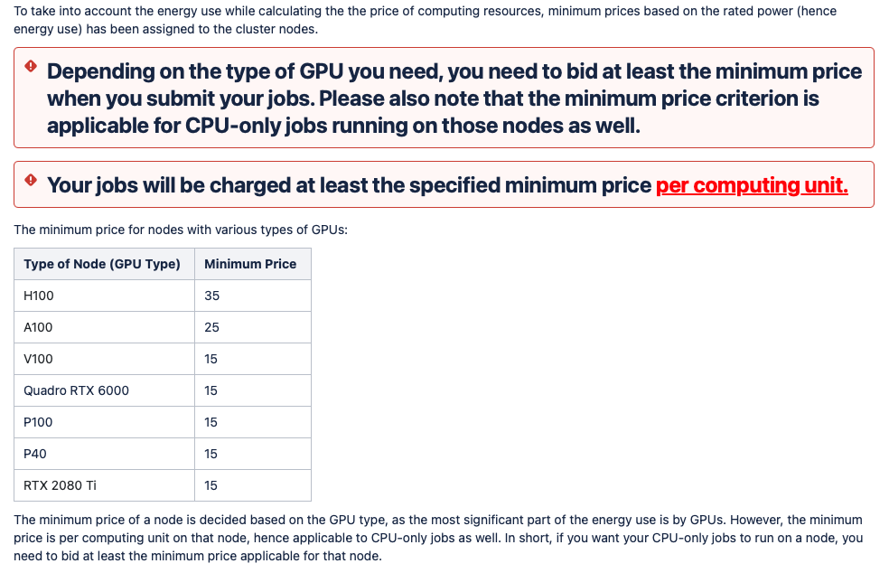

# Job submissions in HTCondor

The cluster you have relies on a banking system, where you get a salary which you can spend to bid on resources.

> <a href="https://logger.cluster.is.localnet/htcondor/banking/#">Cluster Portal</a> (salary, transfers, etc)

> <a href="https://atlas.is.localnet/confluence/">Full Docs</a>

# Interactive sessions (like `salloc`)

```
condor_submit_bid 15 -interactive -append "request_gpus=1" -append "request_cpus=4" -append "request_memory=8GB"
```

# Non-interactive jobs (like `sbatch`)

```
condor_submit_bid 25 -i -append request_cpus=8 -append request_memory=10000
```

# Resource pricing:



# `fast` partition

Does not support filelock. So,

- Can't download `huggingface` models or dataset from the code.
- Need to download the files beforehand into `/fast`
- `wget`, `gdown`, works in `fast`.
